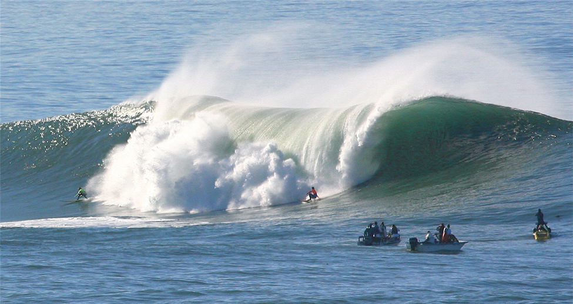

(chap:lecon3)=
# Les ondes mécaniques

:::{admonition} Objectifs d'apprentissage
:class: objped
À la fin de cette section, vous pourrez :

1. Décrire...
:::

Les oscillations - *le mouvement de va-et-vient entre deux points* - impliquent de la force et de l'énergie. Certaines oscillations créent des ondes, comme les ondes sonores créées en pinçant une corde de guitare. D'autres exemples d'ondes incluent les tremblements de terre et la lumière visible. Même les particules subatomiques, telles que les électrons, peuvent se comporter comme des ondes. Vous pouvez faire des vagues d'eau dans une piscine en frappant l'eau avec votre main. Certaines de ces vagues, comme les vagues d'eau, sont visibles ; D'autres, comme les ondes sonores, ne le sont pas. Mais chaque vague est une perturbation qui se déplace à partir de sa source et transporte de l'énergie. Dans ce chapitre, nous allons découvrir les différents types d'ondes, leurs propriétés et la façon dont elles interagissent les unes avec les autres.

```{tableofcontents}
```